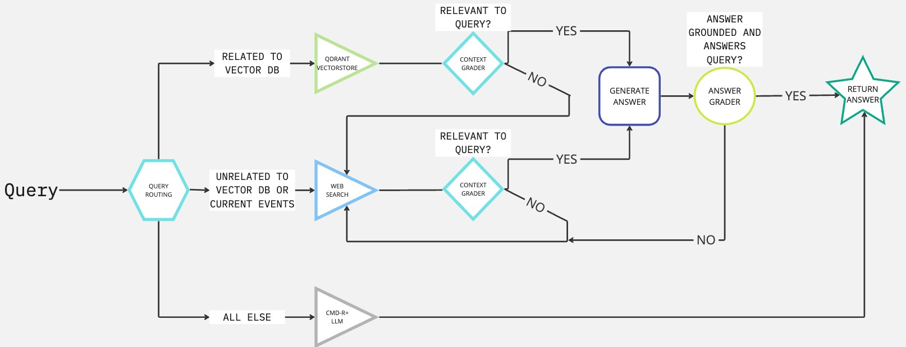

<p align="center">
  
</p>
<p align="center">
    <h1 align="center">Finance AIdvisor</h1>
</p>
<p align="center">
	
	
	
	
<p>
<p align="center">
	<!-- default option, no dependency badges. -->
</p>

<br><!-- TABLE OF CONTENTS -->
<details>
  <summary>Table of Contents</summary><br>

- [Overview](#overview)
- [Repository Structure](#repository-structure)
- [Modules](#modules)
- [Getting Started](#getting-started)
  - [Installation](#installation)
  - [Usage](#usage)
  - [Deploying to Google Cloud Platform](#deploying-to-google-cloud-platform)
- [Sources](#sources)
</details>
<hr>

##  Overview

Finance AIdvisor is an chatbot with access to financial advice documents from the Reddit Personal Finance wiki. It is designed to answer any questions about finance, but can also answer unrelated questions due to the initial training of the LLM and the web search tool. It is an agentic RAG system that utilizes large language models(LLM) to evaluate a user's query, a vector database to retrieve information related to the query, a web search tool to answer any query unrelated to the database, and again using the LLM to assess and assemble the context into an answer. The answer is then graded for hallucinations and if grounded, will output a response to the initial query. The frontend UI is extremely simple and built using Streamlit. The front end is connected to the backend using LangServe which is built on top of FastAPI. The backend architecture is built from the Langchain and Langgraph framework, Qdrant vector database, Voyager embedding model, and Cohere Command R+ and Llama3 for query answering and context filtering, respectively. The user can supply their own API keys to use different models as they choose. The application can be run locally using the Docker Compose file or deployed to Google Cloud Platform(GCP). The workflow trace is logged to LangSmith. User must provide their own vector database and subsequent documents for use.

This project's purpose is to demonstrate the usage of the above mentioned tools and has many areas for improvement in latency, accuracy, structure, and more.

Note: ALl APIs used are free, so rate limits will apply. GCP will incur charges, be aware when using.

<!-- ---

##  Features

|     |   Feature          | Description  |
|----|-------------------|---------------------------------------------------------------|
| ⚙️   | **Architecture**   | The codebase has multiple architectures for different environments, including a local development setup and a cloud-native deployment setup. Utilizes Python, Poetry, Docker, and Cloud Build services to streamline package management and dependency installation. Max 50 words. |
| 🔩  | **Code Quality**   | Code quality is generally good with clear variable names, concise functions, and proper error handling. However, some functions could be further optimized for performance. Utilizes Python type hinting and has a consistent coding style. Max 50 words. |
| 📄  | **Documentation**  | Documentation is limited, but there are some code comments and notes that provide context about certain functions and variables. Additional documentation would greatly improve the project's maintainability and readability. Max 50 words. |
| 🔌  | **Integrations**   | The project has several integrations, including Google Cloud Platform, Uvicorn, Langserve, Pydantic, LLMA, and human evaluators. Utilizes Docker and Poetry to manage dependencies and simplify package installation. Max 50 words. |
| 🧩  | **Modularity**     | The codebase is modular, with different components designed for specific tasks (e.g., cloud deployment, local development, testing). Functions are generally reusable, and the architecture supports flexibility and scalability. Max 50 words. |
| 🧪  | **Testing**        | The project has some tests in place using Python's built-in testing framework. Test cases cover basic functionality and edge cases. Additional test coverage for specific components and scenarios would improve the project's reliability and maintainability. Max 50 words. |
| ⚡️   | **Performance**    | Performance is generally good, with most functions optimized for speed. However, some parts of the code could be further optimized to handle increased traffic or larger datasets. Utilizes Python's built-in concurrency features to support multiple requests simultaneously. Max 50 words. |
| 🛡️  | **Security**       | The project uses environment variables and `dotenv` integration to store sensitive data securely. Additionally, the cloud deployment setup utilizes Cloud Build and App Engine for secure and managed deployments. However, some areas could be further secured by implementing authentication and authorization mechanisms. Max 50 words. |
| 📦  | **Dependencies**   | The project relies on various dependencies, including Poetry, Python, Docker, Uvicorn, LLMA, human evaluators, and more. These dependencies support specific functionality, such as cloud deployment, testing, or language processing. Additional dependency management would help maintain the project's stability and reliability. Max 50 words. | -->

---

##  Repository Structure

```sh
└── finance_ai/
    ├── Dockerfile_gcp
    ├── Dockerfile_local
    ├── README.md
    ├── app
    │   ├── __init__.py
    │   ├── app.py
    │   ├── backend.py
    │   └── server.py
    ├── cloudbuild.yaml
    ├── docker-compose.yml
    ├── poetry.lock
    ├── pyproject.toml
    ├── start.sh
    └── test
        └──test.ipynb
```

---

##  Modules

<details closed><summary>root</summary>

| File                                                                                      | Summary                                                                                                                                                                                                                                                                                                                                                                                     |
| ---                                                                                       | ---                                                                                                                                                                                                                                                                                                                                                                                         |
| [Dockerfile_local](https://github.com/tyw006/finance_ai/blob/master/Dockerfile_local)     | Dockerfile for running local version of the application. **Add your own API keys to the ENV variables.** Used in docker-compose.yml. |
| [cloudbuild.yaml](https://github.com/tyw006/finance_ai/blob/master/cloudbuild.yaml)       | Automating Cloud-Native Deployment!This file enables automated deployment of a cloud-native application, leveraging Googles Cloud Build and Run services. It builds a Docker image from the local `Dockerfile_gcp`, pushes it to a Artifact Registry, deploys the app to Cloud Run, sets environment variables, and secures API keys for various integrations through Secrets Manager.**Need to setup your own project and secrets in GCP and initiate gcloud cli before running.**                      |
| [pyproject.toml](https://github.com/tyw006/finance_ai/blob/master/pyproject.toml)         | Configure dependencies for the finance_ai application using Poetry. This file defines essential packages such as Uvicorn, Langserve, Pydantic, and others to support AI-powered financial analysis and streamlit-based visualization tools within the repositorys architecture.                                                                                                             |
| [Dockerfile_gcp](https://github.com/tyw006/finance_ai/blob/master/Dockerfile_gcp)         | Dockerfile for Google Cloud Platform environment. Defines base image, installs Poetry package manager, and configures virtual environments. Copies application code, packages, and scripts to designated locations, and exposes ports. Initializes project with start script. Facilitates development on Google Cloud Platform.                      |
| [docker-compose.yml](https://github.com/tyw006/finance_ai/blob/master/docker-compose.yml) | Docker-compose file for easy local start up of the application. Simply run "docker-compose up" in terminal while Docker desktop is running to build dockerfile_local and run start.sh. Application will be accessible at localhost:8501.                                                                                                                 |
| [start.sh](https://github.com/tyw006/finance_ai/blob/master/start.sh)                     | Bash script to start backend and front end of the application.                                                                                                                                                                                                                                                                                                                 |

</details>

<details closed><summary>app</summary>

| File                                                                          | Summary                                                                                                                                                                                                                                                                                                                                                                                                                                                                                                                                                                                                                                                                                                            |
| ---                                                                           | ---                                                                                                                                                                                                                                                                                                                                                                                                                                                                                                                                                                                                                                                                                                                |
| [server.py](https://github.com/tyw006/finance_ai/blob/master/app/server.py)   | LangServe for serving backend to front end application. Using FastAPI to connect front end to back end.                                                                                                                                                                                                                                                                                                                     |
| [backend.py](https://github.com/tyw006/finance_ai/blob/master/app/backend.py) | Backend for the application that uses LangGraph to define nodes for agentic structure. Each node performs a different function such as Vector Database retrieval, Web Search, grading retrieved results, generating an answer, and grading the answer for hallucinations and relevancy to the query. These use a variety of tools such as LLMs, vector databases, 
| [app.py](https://github.com/tyw006/finance_ai/blob/master/app/app.py)         | Simple chat interface using Streamlit. Queries will be routed to the backend and answers will appear in the chat along with the sources used to generate the answer.                                                                                                                                                                                                                                                                                                                                |

</details>

<details closed><summary>test</summary>

| File                                                                           | Summary                                                                                                                                                                                                                                                                                                                                                                                                                                                                                                                                                                                                                                                                                                                                                                                                                                                      |
| ---                                                                            | ---                                                                                                                                                                                                                                                                                                                                                                                                                                                                                                                                                                                                                                                                                                                                                                                        
| [test.ipynb](https://github.com/tyw006/finance_ai/blob/master/test/test.ipynb) | Test notebook for developing the backend. Example of creating vector database and uploading chunks to the database included within. Run each cell to understand the function of each node in the backend. |

</details>

---

##  Getting Started

**System Requirements:**

* **Python**, **Docker**, **Google Cloud SDK(Optional)**

**Other Requirements:**

* API keys to LLM, API Key to Vector Database with documents ingested


###  Installation

<h4>From <code>source</code></h4>

> 1. Clone the finance_ai repository:
>
> ```console
> $ git clone https://github.com/tyw006/finance_ai
> ```
>
> 2. Change to the project directory:
> ```console
> $ cd finance_ai
> ```
>
> 3. Install the dependencies:
> ```console
> $ poetry install
> ```

###  Usage

<h4>From <code>source</code></h4>

Modify dockerfile_local with appropriate API keys per ENV variable. 
> Run finance_ai locally using Docker below:
> ```console
> $ docker-compose up -d
> ```

> Access from browser:
> ```console
> localhost:8501
> ```

---
### Deploying to Google Cloud Platform
> Google Cloud SDK must be initialized. Permissions for Cloud Build, Artifiact Registry, Secrets Manager, Cloud Run must be enabled. Edit cloudbuild.yaml with your own secrets. In the console:
> ```console
> gcloud builds submit --config cloudbuild.yaml .
>```
<!-- ##  Project Roadmap

- [X] `► INSERT-TASK-1`
- [ ] `► INSERT-TASK-2`
- [ ] `► ...` 

<!-- ---

##  Contributing

Contributions are welcome! Here are several ways you can contribute:

- **[Report Issues](https://github.com/tyw006/finance_ai/issues)**: Submit bugs found or log feature requests for the `finance_ai` project.
- **[Submit Pull Requests](https://github.com/tyw006/finance_ai/blob/main/CONTRIBUTING.md)**: Review open PRs, and submit your own PRs.
- **[Join the Discussions](https://github.com/tyw006/finance_ai/discussions)**: Share your insights, provide feedback, or ask questions.

<details closed>
<summary>Contributing Guidelines</summary>

1. **Fork the Repository**: Start by forking the project repository to your github account.
2. **Clone Locally**: Clone the forked repository to your local machine using a git client.
   ```sh
   git clone https://github.com/tyw006/finance_ai
   ```
3. **Create a New Branch**: Always work on a new branch, giving it a descriptive name.
   ```sh
   git checkout -b new-feature-x
   ```
4. **Make Your Changes**: Develop and test your changes locally.
5. **Commit Your Changes**: Commit with a clear message describing your updates.
   ```sh
   git commit -m 'Implemented new feature x.'
   ```
6. **Push to github**: Push the changes to your forked repository.
   ```sh
   git push origin new-feature-x
   ```
7. **Submit a Pull Request**: Create a PR against the original project repository. Clearly describe the changes and their motivations.
8. **Review**: Once your PR is reviewed and approved, it will be merged into the main branch. Congratulations on your contribution!
</details>

<details closed>
<summary>Contributor Graph</summary>
<br>
<p align="center">
   <a href="https://github.com{/tyw006/finance_ai/}graphs/contributors">
      
   </a>
</p>
</details> -->

---

<!-- ##  License

This project is protected under the [SELECT-A-LICENSE](https://choosealicense.com/licenses) License. For more details, refer to the [LICENSE](https://choosealicense.com/licenses/) file.

--- -->

##  Sources

- Based off of the Adaptive RAG article by Langchain: https://langchain-ai.github.io/langgraph/tutorials/rag/langgraph_adaptive_rag/
- Using Google Cloud Build/Run with Secrets Manager: https://ho3einmolavi.medium.com/how-to-use-secret-manager-in-google-cloud-build-gcp-eb6fad9a2d4a

[**Return**](#-overview)

---
